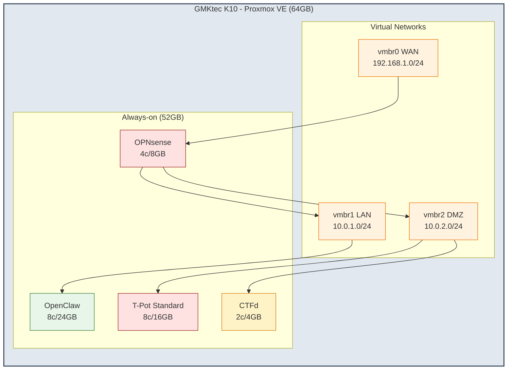

# yamisskey-terraform

Proxmox VE VM provisioning for yamisskey security research infrastructure.

**Host:** GMKtec K10 (64GB RAM / 12C24T)

## VMs

| VM | ID | Spec | Network | Purpose | 運用 |
|----|-----|------|---------|---------|------|
| OPNsense | 101 | 4c/8GB/32GB | vmbr0,1,2 | Router/Firewall | 常設 |
| T-Pot | 100 | 8c/16GB/256GB | vmbr2 | Honeypot (ELK) | 常設 |
| CTFd | 103 | 2c/4GB/40GB | vmbr2 | CTF platform | 常設 |
| OpenClaw | 104 | 8c/24GB/80GB | vmbr1 | Autonomous AI agent | 常設 |

### Resource Profiles (64GB Host)

| Profile | VMs | Memory | Notes |
|---------|-----|--------|-------|
| **Always-on** | OPNsense + T-Pot + CTFd + OpenClaw | 52GB | 常時稼働 |

**Reserved:** Proxmox VE ~4GB / **Free:** ~8GB

## Network

| Bridge | Subnet | Purpose |
|--------|--------|---------|
| vmbr0 | 192.168.1.0/24 | WAN/Management |
| vmbr1 | 10.0.1.0/24 | LAN (OpenClaw) |
| vmbr2 | 10.0.2.0/24 | DMZ (T-Pot, CTFd) |

## Architecture



## Setup

```bash
# 1. Configure secrets (SOPS + age)
sops secrets.sops.yaml

# 2. Deploy
terraform init
terraform apply -var="opnsense_enabled=true"
```

## Templates (on Proxmox)

```bash
# Ubuntu 24.04 (ID: 9000)
qm create 9000 --name ubuntu-24.04-cloudinit --memory 2048 --cores 2 --net0 virtio,bridge=vmbr0
qm importdisk 9000 ubuntu-24.04-server-cloudimg-amd64.img local-lvm
qm set 9000 --scsihw virtio-scsi-pci --scsi0 local-lvm:vm-9000-disk-0 --boot c --bootdisk scsi0
qm set 9000 --ide2 local-lvm:cloudinit --serial0 socket --vga serial0 --agent enabled=1
qm template 9000

# OPNsense ISO
wget https://mirror.ams1.nl.leaseweb.net/opnsense/releases/25.1/OPNsense-25.1-dvd-amd64.iso.bz2
bunzip2 OPNsense-25.1-dvd-amd64.iso.bz2
```

## Docs

- [Setup Guide](docs/setup.md) - Detailed setup instructions

